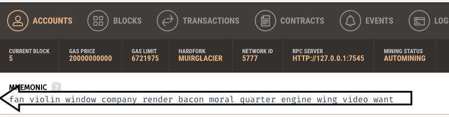
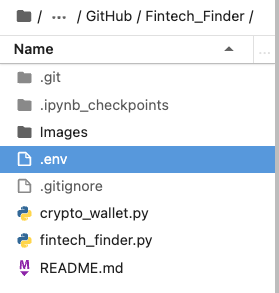
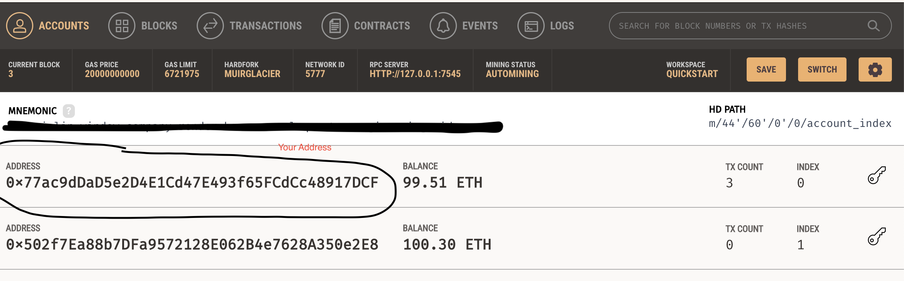
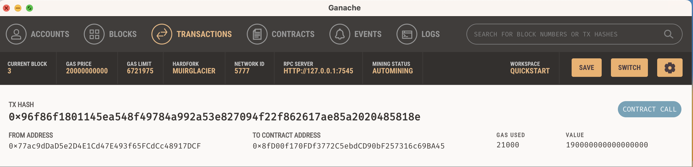
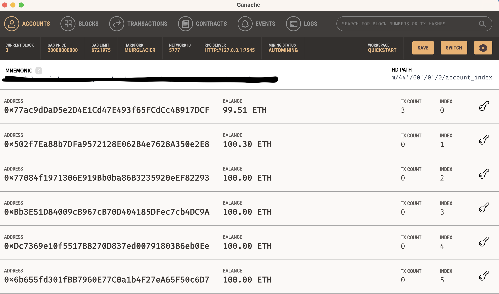
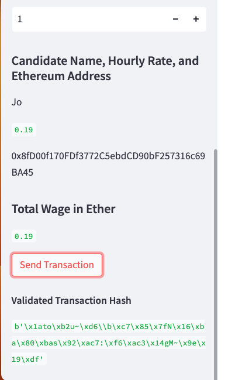
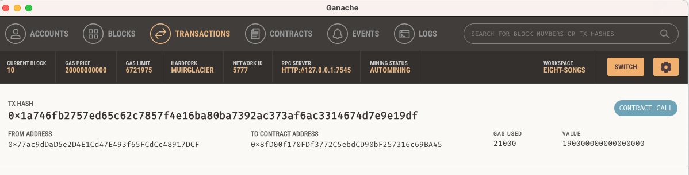
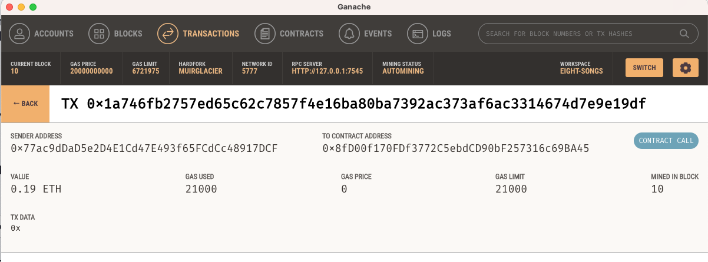

# Fintech_Finder
This project utilizes Streamlit to prototype a deployable app using blockchain payments for contracts with Fintech professionals. 
The python code in this project leverages the program Ganache to create a user's crypto wallet with public and private keys, establishes a list of Fintech professionals to choose from, calculates the total to pay the professional in Ether, estimates a gas price, and finally executes a signed digital tranaction on a local Ganache created blockchain.

---

# Technologies
python 3.8

Web3 5.17

mnemonic 0.20

bip44 0.1.3

os-sys 2.1.4

python-dotenv 0.21.1

ethereum 2.3.2

https://trufflesuite.com/ganache/

---

# Required Libraries
import os

from dotenv import load_dotenv

import streamlit as st

from dataclasses import dataclass

from typing import Any, List

from bip44 import Wallet

from eth_account import Account

from web3 import middleware

from web3.gas_strategies.time_based import medium_gas_price_strategy

from web3 import Web3

w3 = Web3(Web3.HTTPProvider('HTTP://127.0.0.1:7545'))

---

# Install Fintech Finder
1. Open your terminal and start a new dev env

`conda create -n dev python=3.8 anaconda`
    
2. Activate your dev envnironment

`conda activate dev`
    
3. Install required Technologies in development environment
```
pip install web3
pip install mnemonic
pip install bip44
pip install os-sys
pip install python-dotenv
pip install ethereum
```

4. In the directory of your choice, clone this repository

`git clone https://github.com/Arty-j/Fintech_Finder.git`

5. Download Ganache to local system
    www.https://trufflesuite.com/ganache/
    
    -click on download to your local system
    
    -open Ganache using a Quick Start button
    
6. At top of the dasboard under the "Accounts" Tab, will be a mnemonic string



    -copy the string to your clipboard
    
7. Create a new .env file in the Fintech Finder directory 

    -open the IDE of your choice and create a new text file
    
    -type `MNEMONIC = "paste your mnemonic string saved on your clipboard from ganache here"`
    
    -save the text file as '.env' file
    

    
    -*this will mnemonic will be used in the `fintech_finder.py` code to create a wallet with public and private key for you use on the local Ganache testing Blockchain*
    
    -your wallet and public address will be listed as the first address on the Ganache dashboard
    
  
    

---

## Run Fintech Finder

1. Navigate to your terminal, in the Fintech_Finder directory

    -run `streamlit run fintech_finder.py`
    
2. Navigate to streamlit page running locally in browser window

3. Enter test information, choosing a person, and entering how many hours you hired them to work.

4. Hit the "Send Transaction" button on the bottom sidebar
    -see the transactions hash code printed below the button verifying the hash code added to the block as the transaction was processed
    
5. You can verify this transaction by navigating to your Ganache dashboard and clicking on the "Transactions" tab



6. The amount paid will also be subtracted from your wallet balance, listed next to your wallet address on the "Accounts" page



**NOTE: the wallet balance is down .49 Ether from 100, because it incluces the .19 Ether paid in this example for 1 hour of work to Jo, and .30 Ether paid to the second address listed (which was done in a previous transaction not covered in this project)**

---
# Additonal Screenshots of Transaction
Hashtag from Streamlit app, of the completed transaction.


Ganache Dashboard, Transactions tab, showing transaction occured (same screenshot as from step 5 above).


Within the screenshot above, click on the "to Contract Address" and get the following screen showing details more clearly.


# Contributors

This project was in conjunction with UC Berkeley staff and myself Jodi Artman.  *github.com/Arty-j*

---

# License

licensed in accordance with UC Berkeley policy